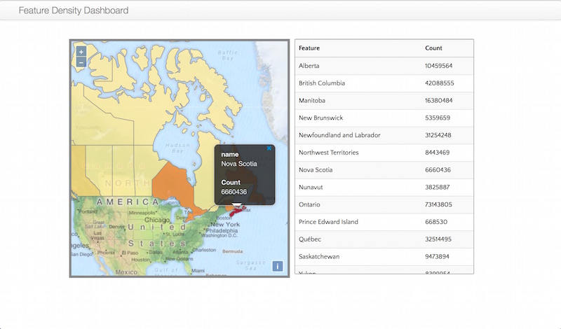

# hadoop-feature-density

Hadoop Feature Density tool is developed using ESRI's GIS Tools for Hadoop toolkit, OpenLayers 3, Bootstrap and jQuery.
<p>The tool gives users a workflow to:</p>

1) Aggregate Big Spatial point feature data in CSV format over Polygons in GeoJSON format<br/>
2) Computes density of points data over geographic area of the Polygons<br/>
3) Divides the density into equal interval classes<br/>
4) Display an interactive map to visualize the density classes in a Thematic map<br/>
<br/>

<br/>

The tool consists of three components

1. FeatureDensity MapReduce Application (Based on ESRI's point-in-polygon aggregation)
2. Dashboard (A simple Feature Density Thematic Map Visualization tool)
3. featuredensity.sh (Shell script to create workflow and act as glue between FeatureDensity MapReduce and Dashboard.

### Example Workflow to Analyze Open Street Maps Data
Imagine that we wish to look at the points of interest data retrieved from Open street maps aggregated over Canada to get 
an insight into the states where there is a high density (feature count divided by area) of a particular kind of features.
OpenStreetsMap data comes with tags that can be used to filter the data. In this example we shall take all the point data.

1. Clone this repository in your local filesystem on which hadoop is installed
2. Install ESRI's Spatial SDK for Hadoop in your local maven repository as follows
   ```
  
   cd hadoop-feature-density 
   
    mvn install:install-file -Dfile=spatial-sdk-hadoop.jar \
   -DgroupId=com.esri.hadoop -DartifactId=spatial-sdk-hadoop -Dversion=1.1.1 -Dpackaging=jar 
   
   ```
3. Obtain Canadian provinces boundaries polygon data and convert into GeoJSON format in WGS84 datum 
4. Copy the boundaries in GeoJSON format to data folder as follows (assuming that downloaded filename is canada.json) 
  ``` 
  cp canada.json hadoop-feature-density/data/polygons/polygons.json
  
  ```
5. Download Open street map data (thanks to the subset done by Geofabrik team) for Canada from the following link

    http://download.geofabrik.de/north-america/canada-latest.osm.pbf


6. Convert the data from OSM Protocolbuffer Binary Format to CSV using Osmconvert as follows

  ```
  ./osmconvert canada-latest.osm.pbf  --max-objects=90000000 --csv="@lon @lat name" \ 
    --drop-ways --drop-relations --csv-separator=, -o=canada.csv
   
  ```
  
7. Copy this canada.csv file to data/points directory

  ```
    cp canada.csv hadoop-feature-density/data/points/points.csv
  ```
  
8. Select an attribute to be used as Key for the output at Reduce stage.
   Imagine that there is an attirbute in polygons.json called **name** that contains names of the provinces
   
9. Launch the featuredensity shell script as follows
   ```

    ./featuredensity.sh name 1 2 -1 -1

   ```

    where 
 
    name : Attribute name from polygons.json that would be used for reporting by Dashboard
    
    1 : Indicates that Longitude values are in the first column of CSV
    
    2 : Indicates that Latitude values are in the second column of the CSV file
    
    -1 -1: To inform the script that we do not wish to do text based filtering on CSV data durin Map stage
        
        

10. The last output from the script will be the command that needs to be run in terminal in order to launch Dashboard in firefox.

   ```
    nohup firefox Dashboard/index.html?attribute=name\&format=geojson&
   ```
